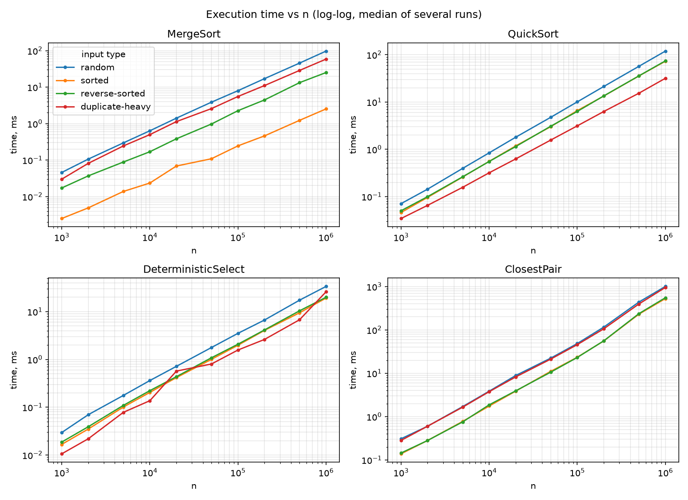
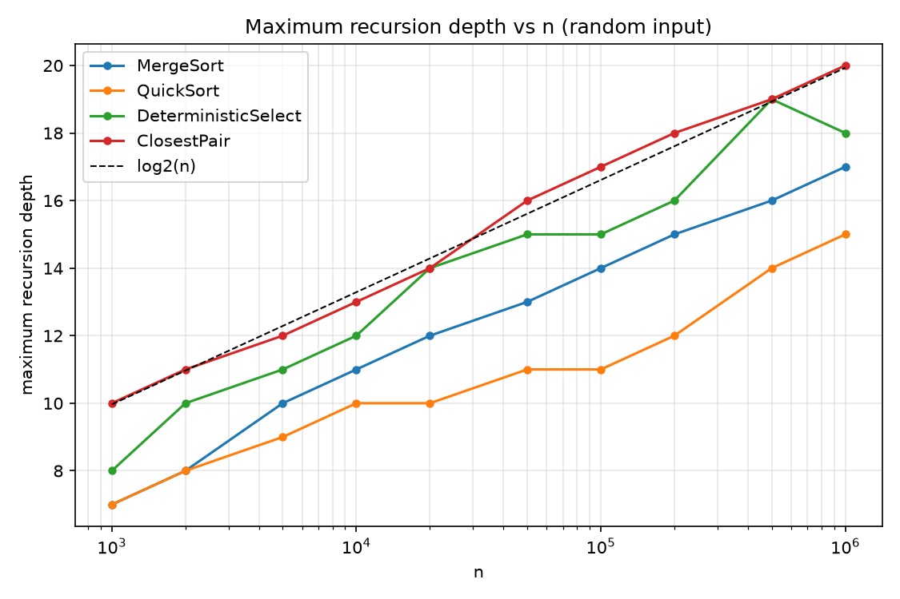
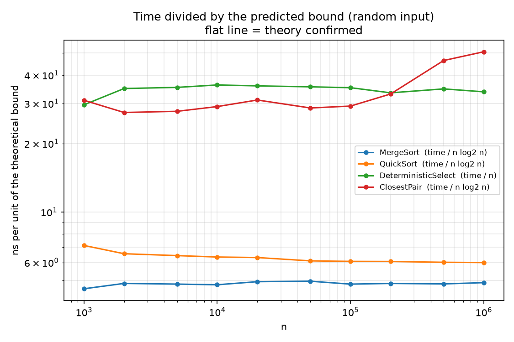
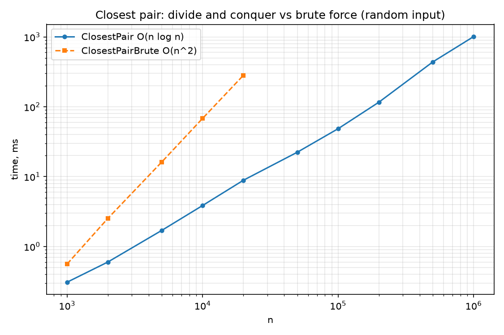
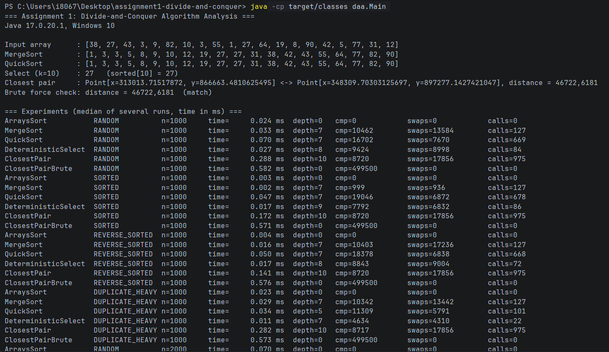
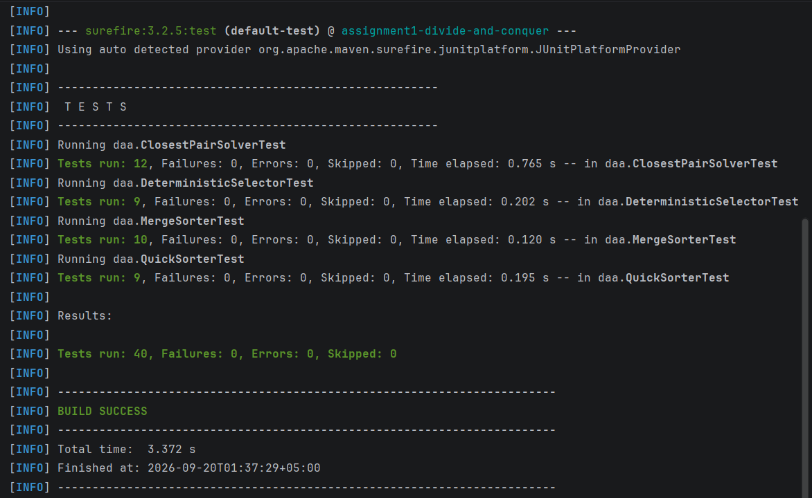
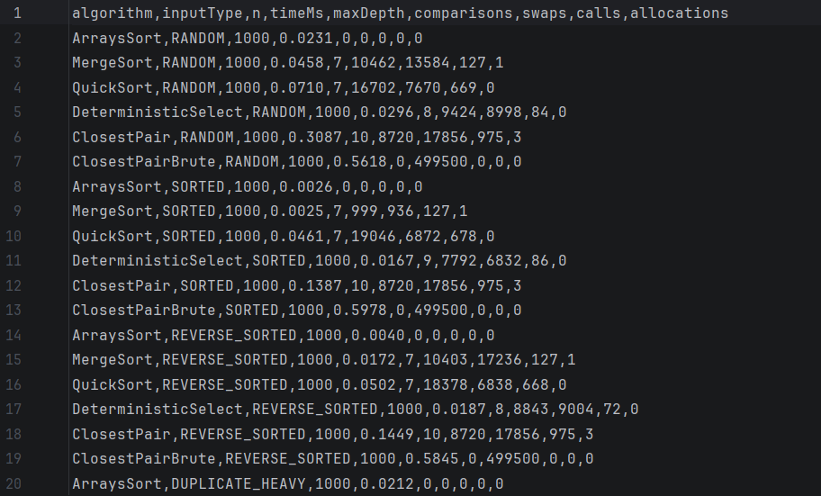

# Assignment 1 — Divide-and-Conquer Algorithm Analysis

**Course:** DAA · **Author:** Kuhta Igor (SE-2530) · **Stack:** Java 17, Maven, JUnit 5, Python (matplotlib) for the plots

---

## A. Project Overview

### Purpose

The goal of this assignment is to implement four classic divide-and-conquer algorithms in Java, derive their running-time
recurrences (Master Theorem / Akra–Bazzi intuition), measure them on inputs of different size and structure
(time, recursion depth, comparisons, swaps, allocations) and compare the measurements with the theory.

### Implemented algorithms

| Class | Algorithm | Key features | Time | Extra space |
|---|---|---|---|---|
| `MergeSorter` | MergeSort | linear merge, one reusable buffer, insertion-sort cutoff (16), skips merging already ordered halves | Θ(n log n) | O(n) |
| `QuickSorter` | QuickSort | randomized pivot, in-place 3-way partition, recurse into the **smaller** part and loop over the larger | O(n log n) expected, O(n²) worst | O(log n) |
| `DeterministicSelector` | Median-of-Medians Select | groups of 5, median-of-medians pivot, in-place partition, recurse only into the needed part | Θ(n) worst case | O(log n) stack |
| `ClosestPairSolver` | Closest Pair of Points | sort by x once, recursive halves merged by y, strip check of ≤ 7 neighbours | Θ(n log n) | O(n) |

Supporting classes: `Point` (immutable record), `Metrics` (counters + recursion depth), `Experiment` (benchmarks, CSV output),
`Main` (demo + full experiment run).

### Repository structure

```
assignment1-divide-and-conquer/
├── src/daa/            MergeSorter, QuickSorter, DeterministicSelector, ClosestPairSolver,
│                       Experiment, Point, Metrics, Main
├── tests/daa/          JUnit 5 tests (one class per algorithm)
├── docs/
│   ├── plots/          time_vs_n.png, depth_vs_n.png, time_normalized.png, closest_pair_vs_brute_force.png
│   ├── screenshots/    program_output.png, test_results.png, results_csv.png
│   └── plot_results.py script that builds the plots and results/tables.md from results.csv
├── results/
│   ├── results.csv     raw measurements (220 rows)
│   └── tables.md       the same data as Markdown tables
├── README.md
├── pom.xml
└── .gitignore
```

### How to build, test and run

```bash
mvn test                                   # 40 JUnit tests
mvn compile
java -cp target/classes daa.Main           # demo + full experiment (about 1 minute) -> results/results.csv
java -cp target/classes daa.Main --quick   # small sizes only (a few seconds)
pip install pandas matplotlib && python docs/plot_results.py   # regenerate plots and tables
```

### Design decisions worth knowing

* **QuickSort uses a three-way (Dutch national flag) partition.** A classic two-way partition degrades to Θ(n²) when many keys are equal
  (the assignment asks for duplicate-heavy inputs). With three-way partitioning the block of keys equal to the pivot is never
  touched again.
* **Recursion depth is counted explicitly** (`Metrics.enter()/exit()`), so "maximum recursion depth" in the tables is the real
  call-stack depth of the recursive methods; loop iterations (e.g. the larger QuickSort part) do not add depth.
* **Median of medians moves the group medians to the front of the range** and selects among them in place, so no auxiliary array
  is needed.
* **Closest pair merges by y during the recursion** instead of re-sorting at every level, which is what keeps the combine step linear.
  Squared distances are compared; `sqrt` is taken once at the end.
* **Timing:** `System.nanoTime()` around the algorithm only (input copying is not timed); reported value = median of 3–9 repetitions
  (more repetitions for smaller n); the JIT is warmed up with an untimed sweep first; `System.gc()` is called before every measurement.

---

## B. Algorithm Analysis

### 1. MergeSort

**How it works.** Split the array in halves, sort both recursively, merge the two sorted halves in linear time. Only the left half is
copied to the (single, reusable) buffer; the right half is merged in place from the original array. Ranges of ≤ 16 elements are sorted with
insertion sort (fewer calls, better constants). If `a[mid-1] <= a[mid]` the halves are already in order and the merge is skipped.

**Complexity.** Time Θ(n log n) in every case (Θ(n) on already sorted input thanks to the skip check). Space: Θ(n) buffer + O(log n) stack.
The sort is stable (`<=` takes the left element first).

**Recurrence.** T(n) = 2·T(n/2) + Θ(n). Here a = 2, b = 2, f(n) = Θ(n) = Θ(n^(log₂2)), which is **Case 2** of the Master Theorem,
so T(n) = Θ(n log n). Recursion depth = ⌈log₂(n/16)⌉ + 1.

### 2. QuickSort (randomized, smaller-first)

**How it works.** Pick a random pivot, partition in place into `< pivot | == pivot | > pivot`, recurse into the smaller of the
two outer parts and continue the loop with the larger one.

**Complexity.** Expected time O(n log n) (≈ 1.39·n·log₂n comparisons for distinct keys with a one-comparison partition), worst case O(n²)
(only if random pivots are repeatedly extreme — probability is negligible). Space O(log n) because the recursion always goes into the smaller part.

**Recurrence.**
* Balanced split: T(n) = 2·T(n/2) + Θ(n) → Master Theorem Case 2 → Θ(n log n).
* Any constant-ratio split T(n) = T(αn) + T((1−α)n) + Θ(n): Akra–Bazzi needs p with α^p + (1−α)^p = 1, which gives p = 1, and
  T(n) = Θ(n·(1 + ∫₁ⁿ u/u² du)) = Θ(n log n). So even a 1 : 9 split every time still costs Θ(n log n).
* Worst case T(n) = T(n−1) + Θ(n) = Θ(n²) (unrolling; the Master Theorem does not apply to subtraction recurrences).
* A random pivot lands in the middle half with probability 1/2, so the expected split is "balanced enough" and E[T(n)] = O(n log n).

### 3. Deterministic Select (Median of Medians)

**How it works.** (1) Split the range into ⌈n/5⌉ groups of 5 and sort each group. (2) Collect the group medians and find *their* median
recursively — this is the pivot. (3) Partition around the pivot in place. (4) Recurse only into the part that contains the k-th element
(or stop if k falls in the block of elements equal to the pivot).

**Complexity.** Θ(n) worst case, O(log n) recursion depth (the range shrinks by a constant factor at every level), no auxiliary arrays.

**Recurrence.** T(n) ≤ T(⌈n/5⌉) + T(7n/10 + 6) + Θ(n). The two subproblems have *different* sizes, so the plain Master Theorem does not apply — this is
the Akra–Bazzi situation. Solve (1/5)^p + (7/10)^p = 1. Since 1/5 + 7/10 = 9/10 < 1, we get p < 1, and
T(n) = Θ(n^p · (1 + ∫₁ⁿ u/u^(p+1) du)) = Θ(n^p · (1 + n^(1−p)/(1−p))) = Θ(n). Intuitively: the work per level is Θ(n) and shrinks geometrically
(by a factor of 9/10 per level of the recursion tree), so the total is a geometric series = Θ(n).

### 4. Closest Pair of Points

**How it works.** Sort the points by x once. Recursively solve the left and right halves (each half is returned sorted by y and merged in linear time).
Let d be the best distance found so far. Build the *strip* of points with |x − midX| < d (already in y order) and compare each strip point
only with the following points whose y-difference is < d.

**Why the strip is cheap.** All strip points within a d × 2d rectangle are at least d apart if they lie on the same side, so at most 8 points fit into it — every
point is compared with a constant number (≤ 7) of successors.

**Complexity.** Time Θ(n log n) (initial sort Θ(n log n) + recursion), space Θ(n) (copy of the points, merge buffer, strip buffer).

**Recurrence.** T(n) = 2·T(n/2) + Θ(n) (linear merge by y + linear strip scan) → Master Theorem Case 2 → Θ(n log n). Recursion depth = ⌈log₂(n/3)⌉ + 1 (base case of ≤ 3 points is solved by brute force).

---

## C. Experimental Results

### Setup

* **Sizes:** 1 000, 2 000, 5 000, 10 000, 20 000, 50 000, 100 000, 200 000, 500 000, 1 000 000 (small → large).
* **Input types:** random, sorted, reverse-sorted, duplicate-heavy (integers: 100 distinct values; points: integer grid 1000 × 1000 with many equal points).
  For closest pair, "sorted" / "reverse-sorted" means ordered by x.
* **Algorithms measured:** MergeSort, QuickSort, DeterministicSelect (k = n/2, the median), ClosestPair, plus two references:
  `ArraysSort` (`java.util.Arrays.sort`) and `ClosestPairBrute` (O(n²), only for n ≤ 20 000).
* **Metrics:** time (ms, median of repetitions), maximum recursion depth, comparisons, swaps/moves, recursive calls, allocations.
  Full data: [`results/results.csv`](results/results.csv).
* **Environment:** Windows 10, Java 17.0.20.1, run from the command line (`java -cp target/classes daa.Main`) on a desktop PC. Absolute times depend on the hardware; JIT compilation, garbage collection and other running programs add noise, so the *shape* of the curves is what matters.

### Execution time vs n — random input (ms)

<!-- BEGIN:time -->
| n | ArraysSort | MergeSort | QuickSort | DeterministicSelect | ClosestPair | ClosestPairBrute |
|---|---|---|---|---|---|---|
| 1,000 | 0.023 | 0.046 | 0.071 | 0.030 | 0.309 | 0.562 |
| 2,000 | 0.065 | 0.106 | 0.144 | 0.070 | 0.600 | 2.529 |
| 5,000 | 0.193 | 0.296 | 0.395 | 0.176 | 1.702 | 16.237 |
| 10,000 | 0.409 | 0.636 | 0.842 | 0.362 | 3.863 | 68.147 |
| 20,000 | 0.883 | 1.411 | 1.801 | 0.717 | 8.877 | 281.986 |
| 50,000 | 2.504 | 3.872 | 4.758 | 1.775 | 22.367 | – |
| 100,000 | 5.084 | 8.001 | 10.072 | 3.520 | 48.520 | – |
| 200,000 | 10.863 | 17.084 | 21.336 | 6.681 | 116.289 | – |
| 500,000 | 29.967 | 45.688 | 56.871 | 17.384 | 438.515 | – |
| 1,000,000 | 62.009 | 97.452 | 119.435 | 33.755 | 1009.185 | – |
<!-- END:time -->

### Execution time by input type

n = 100 000 (ms):

<!-- BEGIN:type_100k -->
| algorithm | RANDOM | SORTED | REVERSE_SORTED | DUPLICATE_HEAVY |
|---|---|---|---|---|
| ArraysSort | 5.08 | 0.02 | 0.07 | 2.07 |
| MergeSort | 8.00 | 0.25 | 2.26 | 5.55 |
| QuickSort | 10.07 | 6.58 | 6.33 | 3.13 |
| DeterministicSelect | 3.52 | 1.98 | 2.08 | 1.57 |
| ClosestPair | 48.52 | 23.43 | 23.18 | 45.84 |
<!-- END:type_100k -->

n = 1 000 000 (ms):

<!-- BEGIN:type_1m -->
| algorithm | RANDOM | SORTED | REVERSE_SORTED | DUPLICATE_HEAVY |
|---|---|---|---|---|
| ArraysSort | 62.01 | 0.27 | 0.77 | 19.97 |
| MergeSort | 97.45 | 2.53 | 25.16 | 58.82 |
| QuickSort | 119.44 | 72.93 | 74.18 | 31.79 |
| DeterministicSelect | 33.75 | 19.27 | 19.99 | 26.07 |
| ClosestPair | 1009.18 | 528.67 | 553.09 | 956.56 |
<!-- END:type_1m -->

### Recursion depth

Random input:

<!-- BEGIN:depth -->
| n | MergeSort | QuickSort | DeterministicSelect | ClosestPair |
|---|---|---|---|---|
| 1,000 | 7 | 7 | 8 | 10 |
| 2,000 | 8 | 8 | 10 | 11 |
| 5,000 | 10 | 9 | 11 | 12 |
| 10,000 | 11 | 10 | 12 | 13 |
| 20,000 | 12 | 10 | 14 | 14 |
| 50,000 | 13 | 11 | 15 | 16 |
| 100,000 | 14 | 11 | 15 | 17 |
| 200,000 | 15 | 12 | 16 | 18 |
| 500,000 | 16 | 14 | 19 | 19 |
| 1,000,000 | 17 | 15 | 18 | 20 |
<!-- END:depth -->

By input type, n = 1 000 000:

<!-- BEGIN:depth_type_1m -->
| algorithm | RANDOM | SORTED | REVERSE_SORTED | DUPLICATE_HEAVY |
|---|---|---|---|---|
| MergeSort | 17 | 17 | 17 | 17 |
| QuickSort | 15 | 14 | 14 | 5 |
| DeterministicSelect | 18 | 19 | 18 | 12 |
| ClosestPair | 20 | 20 | 20 | 20 |
<!-- END:depth_type_1m -->

### Additional metrics (n = 1 000 000, random input)

<!-- BEGIN:metrics -->
| algorithm | comparisons | swaps | calls | allocations |
|---|---|---|---|---|
| MergeSort | 20,286,405 | 28,417,087 | 131,071 | 1 |
| QuickSort | 37,929,875 | 18,518,898 | 666,521 | 0 |
| DeterministicSelect | 10,181,198 | 9,773,627 | 6,725 | 0 |
| ClosestPair | 18,689,972 | 37,708,544 | 951,423 | 3 |
<!-- END:metrics -->

`comparisons` for ClosestPair = distance checks + y-merge comparisons (the initial `Arrays.sort` by x is not counted);
`swaps` = swaps or element moves (array writes); `allocations` = auxiliary arrays created.

### Plots

**Time vs n** (all input types, log-log):



**Maximum recursion depth vs n** (random input, dashed line = log₂ n):



**Time divided by the theoretical bound** (n log₂ n; for Select: n). A flat line means the measurements follow the theory:



**Closest pair: divide and conquer vs brute force:**



---

## D. Discussion

### Do the results match the theoretical complexity?

Yes. Dividing the measured time by the predicted bound gives an almost flat line (third plot). For random input, MergeSort costs 4.68 / 4.83 / 4.84 ns per n·log₂n unit at
n = 10⁴ / 10⁵ / 10⁶, QuickSort 6.74 / 6.05 / 5.97 ns, and Deterministic Select 36.0 / 35.3 / 34.1 ns **per element** — i.e. its time is linear (10× more data → 10× more time).
The counters agree: MergeSort performs 1.02·n·log₂n comparisons at n = 10⁶, Select performs 10.2·n comparisons at every size, and the recursion depths follow log₂ n
(MergeSort 17 = ⌈log₂(10⁶/16)⌉ + 1, ClosestPair 20 = ⌈log₂(10⁶/3)⌉ + 1). ClosestPair costs 28.8 / 29.7 ns per n·log₂n at n = 10⁴ / 10⁵ and jumps to 47.9 ns at n = 10⁶: the algorithm works with
millions of `Point` objects, so cache misses and garbage collection add a constant factor that grows once the data no longer fits in the CPU caches. This is a practical effect, not a change of the asymptotic class
(its comparison counts still grow like n·log₂n). Small sizes (n ≤ 5 000) are noisy because of JIT compilation, which is why every point is a median of several runs.

### How does input structure affect performance?

* **MergeSort** has the same recursion depth for every input type (17 at n = 10⁶), but the constant changes a lot: sorted input takes 2.1 ms vs 96.5 ms for random input, because every merge is skipped by the
  `a[mid-1] <= a[mid]` check and the branches are perfectly predictable; reverse-sorted input (25.1 ms) still benefits from predictable merge branches.
* **QuickSort** does **not** degrade on sorted or reverse-sorted input (74.7 / 74.6 ms vs 119.0 ms random) — the random pivot removes the classic O(n²) trap. Duplicate-heavy input is the *fastest* case (30.7 ms, depth 5) thanks to the
  three-way partition: the block of equal keys is excluded from further recursion. With a two-way partition this input would be quadratic.
* **Deterministic Select** is ≈ 1.7–1.8× faster on presorted data (18.9–20.0 ms vs 34.1 ms) and ≈ 1.3× faster with many duplicates (26.8 ms), again because of predictable branches and the three-way partition.
* **ClosestPair** is ≈ 1.8× faster on inputs presorted by x (521–547 ms vs 955 ms) because its first step — sorting by x — is almost free on presorted data (`Arrays.sort` on objects is a TimSort that detects existing runs).
  The duplicate-heavy input costs the same as random input (977 ms vs 955 ms): the Θ(n log n) skeleton (sort + recursion + merges by y) dominates, and once the best distance is 0 the strip becomes empty.

### Why does smaller-first recursion help QuickSort?

The recursive call always receives the **smaller** part, i.e. at most half of the current range, so the range size at least halves with every nested call. The stack depth is therefore at most ⌊log₂ n⌋ + 1 **for every input and every pivot sequence**
(the test suite asserts this for all four input types; measured depth for n = 10⁶ is at most 15, the bound is 20). The larger part is processed by the `while` loop of the same call (manual tail-call elimination) and does not use stack. Without this rule an unlucky
sequence of pivots gives recursion depth Θ(n) — for n = 10⁶ that is a `StackOverflowError` in Java, even though the running time would still be finite. Smaller-first therefore turns the stack space from O(n) worst case into O(log n) guaranteed.

### Why does Median-of-Medians guarantee O(n)?

The pivot is the median of the ⌈n/5⌉ group medians, so at least half of the group medians are ≥ pivot. Each of those groups has 3 elements ≥ its median (the median itself and the two larger elements), which gives at least ≈ 3n/10 elements ≥ pivot and, symmetrically, at least ≈ 3n/10 elements ≤ pivot (minus a constant for the incomplete groups). The recursive call therefore never gets more than 7n/10 + 6 elements. The cost is T(n) ≤ T(n/5) + T(7n/10 + 6) + c·n. Since n/5 + 7n/10 = 0.9·n < n, the subproblems together are only a constant fraction (90 %) of n, so the work per recursion level shrinks geometrically: cn + 0.9cn + 0.81cn + … = 10·cn = O(n). (With groups of 3 the two fractions would be 1/3 and 2/3, adding up to exactly 1, and the same argument would only give Θ(n log n).) Measured: 10.2·n comparisons at every n.

### Why is divide-and-conquer Closest Pair faster than O(n²) for large inputs?

Brute force checks all n(n−1)/2 pairs: 199 990 000 distance checks at n = 20 000. The divide-and-conquer solution does only 262 084 checks for the same input, because the combine step compares each strip point with a constant number of neighbours (the packing argument above)
and therefore costs Θ(n) instead of Θ(n²). Measured: 272 ms (brute force) vs 8.2 ms (divide and conquer) at n = 20 000, a 33× difference that keeps growing — going from n = 1 000 to n = 10 000 multiplies the brute-force time by 112 (≈ 10² as predicted) but the divide-and-conquer time only by 13.3 (≈ 10·log-factor).
Even at n = 1 000 the divide-and-conquer version is already about 2× faster (0.29 ms vs 0.58 ms), although it has extra overhead (sorting objects, allocation, recursion).

### What practical factors affect performance?

* **JIT compilation and warm-up.** The first runs execute in the interpreter; tiny inputs are dominated by compilation time. Hence the warm-up sweep and the median of several repetitions.
* **Garbage collection and allocation.** ClosestPair works on arrays of `Point` objects (many allocations, pointer chasing); the `int[]` algorithms use contiguous memory. This is one reason ClosestPair costs ≈ 29–48 ns per n·log₂n vs ≈ 5 ns for MergeSort.
* **CPU cache and branch prediction.** Sorted inputs are fast for MergeSort (skipped merges) and Select; random inputs cause branch mispredictions in partition and merge loops. The three-way partition performs up to two comparisons per element
  (QuickSort: 1.90·n·log₂n comparisons vs 1.02·n·log₂n for MergeSort), which is why our QuickSort (119 ms) is slower than MergeSort (97 ms) at n = 10⁶ even though it uses no auxiliary buffer — the textbook "QuickSort is faster in practice" claim depends on a tuned two-way partition.
* **Library baseline.** `Arrays.sort` (dual-pivot QuickSort with heavy tuning) needs 65 ms for n = 10⁶ random ints, ≈ 1.5× faster than our MergeSort.
* **Measurement itself.** The counters (`Metrics`) add a small overhead to every algorithm equally; the benchmark runs on a normal desktop OS, so JIT/GC background threads and other programs compete for the CPU; `System.nanoTime()` has a resolution of tens of nanoseconds, which matters only for the smallest inputs.

---

## E. Reflection

The most valuable part of the assignment was seeing how much the constants and the "small details" matter on top of the asymptotics. All four algorithms behaved exactly like their recurrences predict (flat normalised curves), but the details decided
whether an implementation is actually robust: a plain two-way partition would have made QuickSort quadratic on the duplicate-heavy input, and the smaller-first rule is what keeps the recursion depth at 15 instead of potentially n. It was also interesting that our QuickSort turned out slower than MergeSort — measuring
(comparisons 1.90 vs 1.02 per n·log₂n) explained it, which is a good reminder to check theory against counters instead of trusting folklore.

The main implementation challenges were: (1) Median of Medians — moving the group medians to the front of the range so the recursion can work in place, and using absolute indices for k in the sub-ranges; (2) Closest Pair — the dividing x-coordinate has to be read *before* the recursion,
because the recursion reorders the range by y, and the strip must be built from the y-sorted merged range; (3) benchmarking on the JVM — without a warm-up sweep the JIT made small sizes look slower than large ones, and without counting depth explicitly the "recursion depth" of a loop-based QuickSort would have been meaningless.
Having a simple reference for every algorithm (`Arrays.sort`, brute-force closest pair) and 40 tests that compare against them made it easy to trust the implementations before measuring anything.

---

## F. Screenshots

**Program output** (`java -cp target/classes daa.Main`):



**Test results** (4 test classes, 40 tests):



**Results file** (`results/results.csv`) and plots — see section C:



---

## Git workflow

Work was done on feature branches merged into `main` with `--no-ff`: `feature/mergesort`, `feature/quicksort`, `feature/select`, `feature/closest-pair`, `feature/metrics`, `feature/testing`, `docs/report`.
Commit messages follow the pattern `feat(...)`, `docs(...)`, `fix`, `release` (see `git log --oneline --graph`); the final version is tagged `v1.0`.
# assignment1-divide-and-conquer

